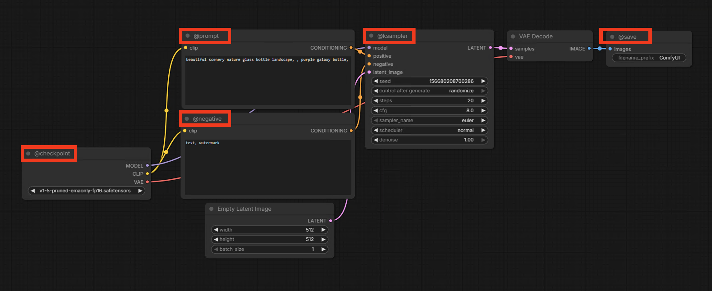

<p align="center">
  
</p>

# ComfyClaw 🐾

A CLI for discovering, inspecting, and running [ComfyUI](https://github.com/comfyanonymous/ComfyUI) workflows — with **tag-based parameter overrides** and **server-aware introspection**.

> **Designed for automation.** An LLM or script can discover workflows, inspect editable parameters, and execute them without ever reading workflow JSON files.

---

## Install

```bash
git clone https://github.com/BuffMcBigHuge/ComfyClaw.git
cd ComfyClaw
npm install
```

---

## Quick Start

```bash
# List available workflows
node cli.js --list

# See what's editable (queries the live server for available models/samplers)
node cli.js --describe text2image-example

# Run with tag-based overrides
node cli.js --run text2image-example outputs \
  --set @prompt.text="a beautiful sunset over the ocean" \
  --set @ksampler.steps=25 \
  --set @ksampler.seed=42
```

---

## Commands

### `--list`

Lists all API workflows in the `workflows/` directory.

```
$ node cli.js --list
Available workflows:

  text2image-example

Total: 1 workflow(s)
```

### `--describe <workflow>`

Shows every `@tag` in a workflow and its editable parameters. If a ComfyUI server is reachable, it queries `/object_info` to show all **valid values** for enum inputs (checkpoints, samplers, schedulers). The currently selected value is marked with ★.

```
$ node cli.js --describe text2image-example
Workflow: text2image-example
Tags: 5
Server: http://localhost:8188

@checkpoint  (node 4, CheckpointLoaderSimple)
  editable:
    --set @checkpoint.ckpt_name="v1-5-pruned-emaonly-fp16.safetensors"
      values (37):
        ★ v1-5-pruned-emaonly-fp16.safetensors
          ...

@ksampler  (node 3, KSampler)
  editable:
    --set @ksampler.seed=156680208700286
    --set @ksampler.steps=20
    --set @ksampler.cfg=8
    --set @ksampler.sampler_name="euler"
      values (44):
        ★ euler
          euler_ancestral
          ...
    --set @ksampler.scheduler="normal"
    --set @ksampler.denoise=1
  linked (do NOT override): model, positive, negative, latent_image

@negative  (node 7, CLIPTextEncode)
  editable:
    --set @negative.text="text, watermark"

@prompt  (node 6, CLIPTextEncode)
  editable:
    --set @prompt.text="beautiful scenery nature glass bottle landscape..."

@save  (node 9, SaveImage)
  editable:
    --set @save.filename_prefix="ComfyUI"
```

### `--run <workflow> [outDir] [--set ...]`

Executes a workflow on a ComfyUI server, downloads output files.

```bash
node cli.js --run text2image-example outputs \
  --set @prompt.text="cinematic neon city at night" \
  --set @negative.text="watermark, blurry" \
  --set @ksampler.steps=30 \
  --set @ksampler.seed=111111
```

**What happens:**
1. Loads workflow, applies `--set` overrides
2. Connects to a ComfyUI server (auto-selects lowest queue)
3. Queues the prompt and waits via WebSocket
4. Downloads output files to `outDir`

---

## Override Syntax

Tag-based (recommended — stable across workflow edits):
```bash
--set @prompt.text="a red cat"
--set @ksampler.steps=30
```

Node-ID based (fallback for untagged workflows):
```bash
--set 6.text="a red cat"
--set 3.steps=30
```

**Safety:** Linked inputs (graph wiring) are never overridden.

---

## The `@tag` System

Tag key nodes in your ComfyUI workflow by setting `_meta.title` to a name starting with `@`:



```json
"6": {
  "class_type": "CLIPTextEncode",
  "inputs": { "text": "a dog", "clip": ["4", 1] },
  "_meta": { "title": "@prompt" }
}
```

Common tags:
| Tag | Typical Node | Key Inputs |
|-----|-------------|------------|
| `@prompt` | CLIPTextEncode | `text` |
| `@negative` | CLIPTextEncode | `text` |
| `@ksampler` | KSampler | `seed`, `steps`, `cfg`, `sampler_name`, `scheduler`, `denoise` |
| `@size` | EmptyLatentImage | `width`, `height` |
| `@checkpoint` | CheckpointLoaderSimple | `ckpt_name` |
| `@save` | SaveImage / VHS_VideoCombine | `filename_prefix` |

Each `@tag` must be unique within a workflow.

---

## Adding Workflows

1. In ComfyUI, click **Save (API Format)** to export your workflow as an API prompt graph (this is the JSON with numeric node IDs as keys — **not** the default UI export)
2. Tag the nodes you want to be editable with `@tag` names in `_meta.title`
3. Save as `workflows/<name>-api.json`
4. Verify with `node cli.js --describe <name>`

> **Important:** ComfyClaw requires the **API format** export. The default "Save" in ComfyUI produces a UI export (with `nodes` and `links` arrays) which is not supported. Use **Save (API Format)** instead.

---

## Environment Variables

| Variable | Default | Description |
|----------|---------|-------------|
| `COMFYUI_SERVER` | (auto-select) | Force a specific server URL |
| `COMFYUI_TIMEOUT_MS` | `180000` | Max wait for workflow completion (ms) |
| `AWS_ACCESS_KEY_ID` | — | AWS credentials (for S3 upload) |
| `AWS_SECRET_ACCESS_KEY` | — | AWS credentials (for S3 upload) |
| `AWS_REGION` | `us-east-1` | AWS region |
| `S3_BUCKET` | — | S3 bucket name |

---

## S3 Upload (Optional)

Output files can be automatically uploaded to AWS S3 after being saved locally. This is **disabled by default**.

### Setup

1. Install the AWS SDK:
```bash
npm install @aws-sdk/client-s3
```

2. Enable in `config.js`:
```js
aws: {
  enabled: true,
  accessKeyId: process.env.AWS_ACCESS_KEY_ID,
  secretAccessKey: process.env.AWS_SECRET_ACCESS_KEY,
  region: process.env.AWS_REGION || "us-east-1",
  bucket: process.env.S3_BUCKET,
  prefix: "outputs/", // Optional key prefix
}
```

3. Set your AWS credentials as environment variables:
```bash
export AWS_ACCESS_KEY_ID="..."
export AWS_SECRET_ACCESS_KEY="..."
export S3_BUCKET="my-comfyclaw-bucket"
```

4. Run as normal — files are uploaded after local save:
```
Saved: outputs/abc123-ComfyUI_00001_.png (1324644 bytes)
  Uploaded to S3: s3://my-comfyclaw-bucket/abc123-ComfyUI_00001_.png
```

> If `@aws-sdk/client-s3` is not installed when `enabled: true`, the CLI will warn and continue without uploading.

---

## Error Handling

ComfyUI validation errors are surfaced with full detail:

```
Error: ComfyUI server error (HTTP 400):
  prompt_outputs_failed_validation: Prompt outputs failed validation
  Node 4 [CheckpointLoaderSimple]:
    - Value not in list
      ckpt_name: 'missing_model.safetensors' not in (list of length 37)
```

| Exit Code | Meaning |
|-----------|---------|
| 0 | Success |
| 1 | Runtime error (server unavailable, execution failed) |
| 2 | Usage error (bad arguments, workflow not found) |

---

## Architecture

```
cli.js              Unified CLI entrypoint (--list, --describe, --run)
workflows.js        Workflow discovery and loading
patch.js            Safe parameter overrides with @tag resolution
comfy.js            ComfyUI WebSocket/HTTP client
helpers.js          Server selection (lowest queue)
config.js           Server and AWS S3 configuration
workflows/          Workflow JSON files (*-api.json)
```

---

## License

MIT
