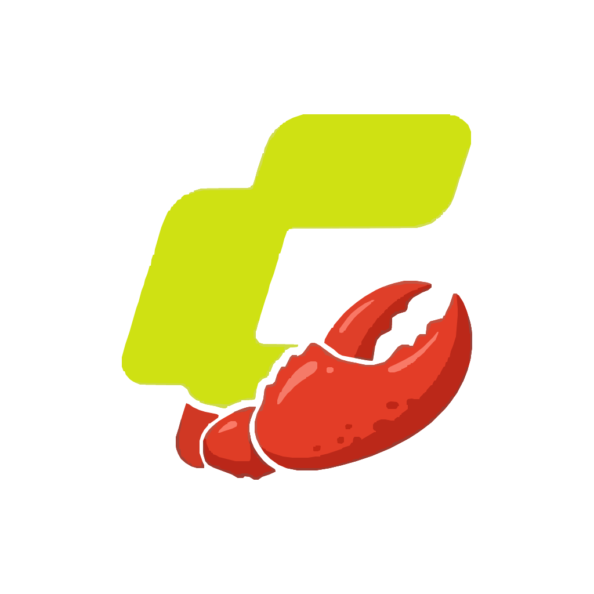
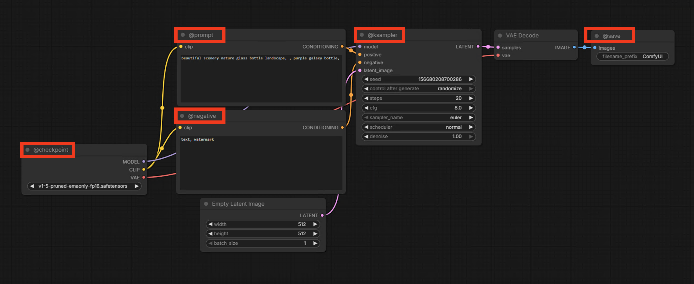

<p align="center">
  
</p>

# ComfyClaw 🐾

A CLI for discovering, inspecting, and running [ComfyUI](https://github.com/comfyanonymous/ComfyUI) workflows — with **tag-based parameter overrides** and **server-aware introspection**.

> **Designed for automation.** An LLM or script can discover workflows, inspect editable parameters, and execute them without ever reading workflow JSON files.

---

## Install

Install globally via npm:

```bash
npm install -g comfyclaw
```

Or clone and link locally:

```bash
git clone https://github.com/BuffMcBigHuge/ComfyClaw.git
cd ComfyClaw
npm install
npm link
```

After either method, the `comfyclaw` command is available globally.

---

## Quick Start

Create a `workflows/` folder in your project directory and place normal ComfyUI UI workflow exports there (see [Adding Workflows](#adding-workflows)).

```bash
# List available workflows
comfyclaw --list

# See what's editable (queries the live server for available models/samplers)
comfyclaw --describe text2image-example

# Discover every API node and scalar key
comfyclaw --describe text2image-example --full

# Validate a batch without uploading or queueing
comfyclaw --check text2image-example --server http://localhost:8188 \
  --mode @optional_branch=active \
  --set 3.steps=25

# Run with tag-based overrides
comfyclaw --run text2image-example outputs \
  --set @prompt.text="a beautiful sunset over the ocean" \
  --set @ksampler.steps=25 \
  --set @ksampler.seed=42
```

---

## Commands

### `--list`

Lists all API workflows in the `workflows/` directory (relative to where you run the command).

```
$ comfyclaw --list
Available workflows:

  text2image-example

Total: 1 workflow(s)
```

### `--describe <workflow>`

Shows every `@tag` in a workflow and its scalar parameters. Add `--full` to print
a node-ID table for the complete API graph, including untagged nodes.

```bash
comfyclaw --describe video-example --full
```

```text
Full node table:
  ID       CLASS                              EDITABLE KEYS
  4        CheckpointLoaderSimple             ckpt_name
  6        CLIPTextEncode                     text
  ...
```

### `--check <workflow> [--set ...] [--file ...]`

Compiles the UI workflow through the selected server's actual frontend, then validates
the complete executable graph and every override against `/object_info`. It does not
upload files or queue the prompt.

```bash
comfyclaw --check video-example --server http://localhost:8188 \
  --switch "@references.reference_1=on" \
  --set "12.aspect_ratio=9:16" \
  --file "@reference_1.image=/path/reference.png"
```

Unique enum labels can use their short form. For example, `9:16` resolves to
`9:16 (Portrait Widescreen)` when that is the only matching option.

### `--diff-ui <workflow>`

Compares `workflows/<name>.json` with `workflows/<name>-api.json` and reports:

- bypassed, muted, frontend-only, and expanded-subgraph nodes;
- rgthree switches retained in the API but missing some of their UI inputs;
- frontend-only `Fast Groups Bypasser` matchers;
- the incoming and outgoing boundaries of stripped chains.

```bash
comfyclaw --diff-ui video-example
```

### `--run <workflow> [outDir] [--set ...]`

Compiles and executes a UI workflow on a ComfyUI server, then downloads output files.

```bash
comfyclaw --run text2image-example outputs \
  --set @prompt.text="cinematic neon city at night" \
  --set @negative.text="watermark, blurry" \
  --set @ksampler.steps=30 \
  --set @ksampler.seed=111111
```

**What happens:**
1. Loads the UI workflow into the selected server's frontend and custom extensions
2. Applies `--mode` and `--switch` controls
3. Captures the frontend-generated API prompt in memory and validates the complete graph
4. Uploads valid files and applies `--set` / `--file` overrides
5. Queues through `/prompt`, waits via WebSocket, and downloads outputs to `outDir`

---

## Override Syntax

Tag-based (recommended — stable across workflow edits):
```bash
--set @prompt.text="a red cat"
--set @ksampler.steps=30
```

Node-ID based (fallback for untagged workflows):
```bash
--set 6.text="a red cat"
--set 3.steps=30
```

**Safety:** Linked inputs (graph wiring) are never overridden.

UI-native controls are applied before compilation:

```bash
--mode @optional_branch=active
--mode 42=bypass
--switch "@references.reference_1=on"
```

`--switch` addresses a frontend controller and one of its groups. `--describe` lists
the available controller/group selectors generated by the live frontend.

For an unconnected `IMAGE` or `AUDIO` socket, `--file` inserts an implicit `LoadImage`
or `LoadAudio` node and wires it to the target. This includes autogrow inputs such as:

```bash
--file "12.images.image_0=/path/reference.png"
```

---

## The `@tag` System

Tag key nodes in your ComfyUI workflow by setting `_meta.title` to a name starting with `@`:



```json
"6": {
  "class_type": "CLIPTextEncode",
  "inputs": { "text": "a dog", "clip": ["4", 1] },
  "_meta": { "title": "@prompt" }
}
```

Common tags:
| Tag | Typical Node | Key Inputs |
|-----|-------------|------------|
| `@prompt` | CLIPTextEncode | `text` |
| `@negative` | CLIPTextEncode | `text` |
| `@ksampler` | KSampler | `seed`, `steps`, `cfg`, `sampler_name`, `scheduler`, `denoise` |
| `@size` | EmptyLatentImage | `width`, `height` |
| `@checkpoint` | CheckpointLoaderSimple | `ckpt_name` |
| `@save` | SaveImage / VHS_VideoCombine | `filename_prefix` |

Each `@tag` must be unique within a workflow.

---

## Adding Workflows

1. In ComfyUI, use the normal **Save** workflow export.
2. Tag nodes you want to address with titles beginning with `@`.
3. Save the file as `workflows/<name>.json`.
4. Verify it with `comfyclaw --describe <name> --server <url>`.

ComfyClaw loads this source into the server's installed frontend, including custom
extensions, applies UI controls, and captures the exact ephemeral API request produced
by ComfyUI. Generated API JSON is not written to disk. Existing `<name>-api.json` files
remain supported as a legacy fallback when no UI workflow exists.

---

## Inventory

ComfyClaw can discover available models, LoRAs, VAEs, and other assets — either by querying a running ComfyUI server or by scanning local directories.

### Pull from server

```bash
comfyclaw --inventory pull
```

Queries the ComfyUI `/object_info` API and saves a list of all available checkpoints, loras, vaes, upscalers, samplers, and schedulers to `inventory/inventory.json`.

### Scan local directories

```bash
# Scan a ComfyUI models directory
comfyclaw --inventory scan /path/to/ComfyUI/models

# Scan multiple directories
comfyclaw --inventory scan /path/to/checkpoints /path/to/loras
```

Recursively walks the given directories for model files (`.safetensors`, `.ckpt`, `.pt`, `.pth`, `.bin`) and auto-categorizes them based on parent folder names:

| Folder Name | Asset Type |
|-------------|------------|
| `checkpoints/`, `ckpts/` | checkpoints |
| `loras/`, `lora/` | loras |
| `vae/`, `vaes/` | vaes |
| `upscale_models/`, `upscalers/` | upscalers |
| _(other)_ | uncategorized |

Scanned results are merged with any existing inventory.

### Browse assets

```bash
# Summary of all asset types and counts
comfyclaw --inventory list

# List all LoRAs
comfyclaw --inventory list loras

# List all checkpoints
comfyclaw --inventory list checkpoints
```

---

## Environment Variables

| Variable | Default | Description |
|----------|---------|-------------|
| `COMFYCLAW_WORKFLOWS` | `./workflows` | Path to workflows directory |
| `COMFYUI_SERVER` | (auto-select) | Force a specific server URL |
| `COMFYUI_TIMEOUT_MS` | `180000` | Max wait for workflow completion (ms) |
| `COMFYCLAW_BROWSER_PATH` | auto-detect | Chrome or Edge executable used for UI compilation |
| `AWS_ACCESS_KEY_ID` | — | AWS credentials (for S3 upload) |
| `AWS_SECRET_ACCESS_KEY` | — | AWS credentials (for S3 upload) |
| `AWS_REGION` | `us-east-1` | AWS region |
| `S3_BUCKET` | — | S3 bucket name |

Use `--server <url>` to select a server for one command without changing the environment.
The `http://` prefix is optional.

---

## S3 Upload (Optional)

Output files can be automatically uploaded to AWS S3 after being saved locally. This is **disabled by default**.

### Setup

1. Install the AWS SDK:
```bash
npm install @aws-sdk/client-s3
```

2. Enable in `config.js`:
```js
aws: {
  enabled: true,
  accessKeyId: process.env.AWS_ACCESS_KEY_ID,
  secretAccessKey: process.env.AWS_SECRET_ACCESS_KEY,
  region: process.env.AWS_REGION || "us-east-1",
  bucket: process.env.S3_BUCKET,
  prefix: "outputs/", // Optional key prefix
}
```

3. Set your AWS credentials as environment variables:
```bash
export AWS_ACCESS_KEY_ID="..."
export AWS_SECRET_ACCESS_KEY="..."
export S3_BUCKET="my-comfyclaw-bucket"
```

4. Run as normal — files are uploaded after local save:
```
Saved: outputs/abc123-ComfyUI_00001_.png (1324644 bytes)
  Uploaded to S3: s3://my-comfyclaw-bucket/abc123-ComfyUI_00001_.png
```

> If `@aws-sdk/client-s3` is not installed when `enabled: true`, the CLI will warn and continue without uploading.

---

## Error Handling

ComfyUI validation errors are surfaced with full detail:

```
Error: ComfyUI server error (HTTP 400):
  prompt_outputs_failed_validation: Prompt outputs failed validation
  Node 4 [CheckpointLoaderSimple]:
    - Value not in list
      ckpt_name: 'missing_model.safetensors' not in (list of length 37)
```

| Exit Code | Meaning |
|-----------|---------|
| 0 | Success |
| 1 | Runtime error (server unavailable, execution failed) |
| 2 | Usage error (bad arguments, workflow not found) |

---

## Architecture

```
cli.js              Unified CLI entrypoint (--list, --describe, --check, --diff-ui, --run, --inventory)
workflows.js        Workflow discovery and loading
patch.js            Safe parameter overrides with @tag resolution
validation.js       Live-schema validation, enum resolution, and implicit file loaders
ui-compiler.js      Native ComfyUI frontend compilation and UI control application
workflow-diff.js    UI/API export loss and rgthree diagnostics
comfy.js            ComfyUI WebSocket/HTTP client
helpers.js          Server selection (lowest queue)
inventory.js        Model/LoRA/VAE inventory (pull, scan, list)
config.js           Server and AWS S3 configuration
workflows/          UI workflow JSON files (`<name>.json`); legacy API files are optional
inventory/          Discovered asset lists and metadata
```

---

## License

MIT
